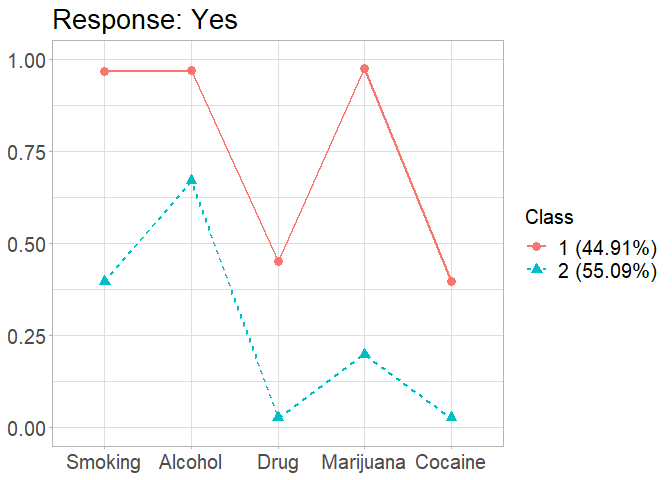

<!-- README.md is generated from README.Rmd. Please edit that file -->
gscaLCA
=======

<!-- badges: start -->
<!-- badges: end -->
The goal of gscaLCA is to execute Latent Class Analysis by using Generalized Structure Component Analaysis(GSCA).

Installation
------------

<!-- You can install the released version of gscaLCA from [CRAN](https://CRAN.R-project.org) with: -->
``` r
install.packages("gscaLCA")
```

And the development version from [GitHub](https://github.com/) with:hee6904/gscaLCA

``` r
# install.packages("devtools")
devtools::install_github("hee6904/gscaLCA")
```

Example
-------

This is a basic example.

``` r
library(gscaLCA)
#> Loading required package: gridExtra
#> Loading required package: ggplot2
#> Loading required package: stringr
#> Loading required package: progress
#> Loading required package: psych
#> 
#> Attaching package: 'psych'
#> The following objects are masked from 'package:ggplot2':
#> 
#>     %+%, alpha
#> Loading required package: fastDummies
#> Loading required package: fclust
#> Loading required package: MASS
#> Loading required package: devtools
#> Loading required package: usethis
#> Loading required package: doSNOW
#> Loading required package: foreach
#> Loading required package: iterators
#> Loading required package: snow
#> Loading required package: doParallel
#> Loading required package: parallel
#> 
#> Attaching package: 'parallel'
#> The following objects are masked from 'package:snow':
#> 
#>     clusterApply, clusterApplyLB, clusterCall, clusterEvalQ,
#>     clusterExport, clusterMap, clusterSplit, makeCluster,
#>     parApply, parCapply, parLapply, parRapply, parSapply,
#>     splitIndices, stopCluster
## basic example code
```

Running gscaLCA AddHealth data. The number of cluster is 2 and the number of bootstrap is 20.

``` r
R2 = gscaLCA(AddHealth, varnames = names(AddHealth)[2:6], num.cluster = 2)
#> Warning in gscaLCA(AddHealth, varnames = names(AddHealth)[2:6], num.cluster
#> = 2): Listwise delection was used. Uncompleted data is not available in the
#> current version
#> =========================================================
#> LCA by using Fuzzing Clusterwise GSCA
#> =========================================================
#> Fit for 2 latent classes: 
#>  number of used observations: 5066 
#>  number of deleted observation: 48 
#>  number of bootstrap for SE: 20 / 20 
#> 
#> MODEL FIT -----------------------------------------------
#>  FIT      :  0.9997 
#>  AFIT     :  0.9997 
#>  FPI      :  0.6818 
#>  NCE      :  0.7504 
#>  
#> Estimated Latent Class Prevalnces (%) -------------------
#>  55.09% 44.91% 
#>  
#> Conditional item response probability -------------------
#>  $Smoking
#>            Class Category Estimate
#> 1 Latent Class 1      Yes   0.3956
#> 2 Latent Class 1       No   0.6044
#> 3 Latent Class 2      Yes   0.9653
#> 4 Latent Class 2       No   0.0347
#> 
#> $Alcohol
#>            Class Category Estimate
#> 1 Latent Class 1      Yes   0.6686
#> 2 Latent Class 1       No   0.3314
#> 3 Latent Class 2      Yes   0.9684
#> 4 Latent Class 2       No   0.0316
#> 
#> $Drug
#>            Class Category Estimate
#> 1 Latent Class 1      Yes   0.0262
#> 2 Latent Class 1       No   0.9738
#> 3 Latent Class 2      Yes   0.4497
#> 4 Latent Class 2       No   0.5503
#> 
#> $Marijuana
#>            Class Category Estimate
#> 1 Latent Class 1      Yes   0.1985
#> 2 Latent Class 1       No   0.8015
#> 3 Latent Class 2      Yes   0.9754
#> 4 Latent Class 2       No   0.0246
#> 
#> $Cocaine
#>            Class Category Estimate
#> 1 Latent Class 1      Yes   0.0254
#> 2 Latent Class 1       No   0.9746
#> 3 Latent Class 2      Yes   0.3956
#> 4 Latent Class 2       No   0.6044
```


